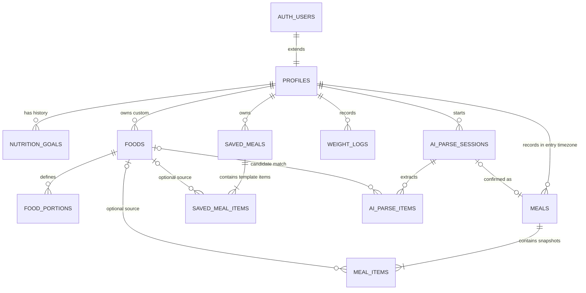

# Modelo de dados do MVP

O schema inicial está implementado em migrations PostgreSQL versionadas. Ele define a estrutura do MVP, sem importar TACO ou qualquer outro catálogo. A TACO/UNICAMP é a primeira fonte planejada; `foods` permanece independente de fornecedor para aceitar outras fontes no futuro.

## ERD



`AUTH_USERS` representa `auth.users`, gerenciada pelo Supabase Auth e não recriada em `public`.

## Tabelas e ownership

| Tabela | Finalidade | Ownership/visibilidade |
| --- | --- | --- |
| `profiles` | nome de exibição e timezone IANA | `id = auth.uid()` |
| `nutrition_goals` | histórico de metas com vigência | privada por `user_id` |
| `foods` | catálogo global e alimentos pessoais | global ativo é legível; pessoal é privado |
| `food_portions` | conversão doméstica específica do alimento | herda visibilidade/mutabilidade de `foods` |
| `meals` | refeição confirmada | privada por `user_id` |
| `meal_items` | itens e snapshots confirmados | herda ownership de `meals` |
| `saved_meals` | favorito/template, não consumo | privada por `user_id` |
| `saved_meal_items` | composição reutilizável | herda ownership de `saved_meals` |
| `weight_logs` | peso opcional | privada por `user_id` |
| `ai_parse_sessions` | ciclo de vida de um draft de parsing | privada por `user_id` |
| `ai_parse_items` | candidatos estruturados da IA | herda ownership da sessão |

Triggers adicionais verificam que `meal_items`, `saved_meal_items` e `ai_parse_items` não referenciem um alimento personalizado de outro usuário. Uma foreign key isolada garantiria existência, mas não isolamento de tenant.

## Database invariants

- Uma refeição confirmada nunca depende do estado atual de `foods` para reconstruir seus macros; `meal_items` contém o snapshot utilizado na confirmação.
- Um alimento privado nunca pode ser lido, alterado ou referenciado por outro usuário, inclusive indiretamente por tabelas filhas.
- Um template em `saved_meals` não representa consumo e não possui snapshot nutricional histórico.
- Uma sessão de parsing é um draft; somente confirmação explícita cria uma `meal` e seus snapshots.
- `timezone_at_entry` é imutável e registra qual timezone produziu `local_date`; nenhum deles depende de mudanças posteriores em `profiles.timezone`.
- Períodos de `nutrition_goals` de um mesmo usuário não se sobrepõem; períodos adjacentes são válidos.
- Uma refeição removida logicamente preserva seus itens. Queries do diário ativo sempre filtram `deleted_at is null`.

## Catálogo e quantidades

### Alimentos globais e personalizados

Um alimento global tem `owner_user_id = null`, uma identidade externa (`source`, `source_food_id`, `source_version`) e é verificado. O índice único dessa identidade permite múltiplas fontes e versões sem acoplar o domínio à TACO.

Um alimento personalizado tem `owner_user_id`, `source = 'user'`, não pode se declarar verificado e não possui `source_food_id`. `is_active` retira um alimento de buscas sem apagar referências históricas.

Nutrientes usam `numeric`, nunca tipos de ponto flutuante, e representam valores por 100 unidades de `basis_unit`, que só pode ser `g` ou `ml`. O schema armazena os quatro nutrientes do MVP; novos nutrientes podem ser modelados quando houver um caso real.

### Política inicial de `normalized_name`

A futura importação e os services devem produzir `normalized_name` na seguinte ordem determinística:

1. aplicar Unicode NFKD;
2. remover marcas combinantes/acentos;
3. converter para lowercase com regra consistente de locale;
4. aplicar `trim` nas extremidades;
5. substituir toda sequência de whitespace por um único espaço.

Não haverá stemming, singularização automática do português ou fuzzy search nesta fase. O nome original permanece em `name`; a forma normalizada serve para identidade/busca e deve ser gerada por uma única função compartilhada quando o importador for implementado.

### Porções

`food_portions` converte uma expressão específica daquele alimento para sua unidade canônica. Por exemplo, `quantity = 1`, `unit = 'unidade'` e `canonical_quantity = 50` para um alimento cuja `basis_unit = 'g'`. Não existe tabela universal que afirme que toda colher ou fatia tem o mesmo peso.

## Metas históricas

`nutrition_goals` usa intervalos de datas semiabertos: `effective_from` é inclusivo e `effective_until` é exclusivo; `null` significa sem fim definido. Uma exclusion constraint GiST em `(user_id, daterange(...))` rejeita períodos sobrepostos no banco, inclusive sob concorrência. Assim, existe no máximo uma meta aplicável a uma data por usuário.

## Refeições, timezone e snapshots

Todos os instantes são `timestamptz`. `profiles.timezone` é validado contra os nomes conhecidos pelo PostgreSQL. `meals.timezone_at_entry` também exige um timezone IANA válido. No insert, a aplicação pode fornecê-lo explicitamente; quando omite, uma trigger copia `profiles.timezone`. A mesma trigger calcula `local_date` a partir de `eaten_at` e `timezone_at_entry`.

Persistir ambos é intencional: uma refeição retroativa pode declarar o timezone real do evento, sem exigir histórico global de timezone do perfil. Depois da criação, `timezone_at_entry` e ownership são imutáveis. Uma alteração explícita de `eaten_at` recalcula o dia usando o timezone congelado; alterar `local_date` diretamente é rejeitado. Mudar `profiles.timezone` nunca reclassifica refeições históricas. A migration preenche eventuais linhas anteriores com o timezone atual do perfil; como ainda não há dados de produção, não existe perda conhecida, mas uma implantação sobre dados reais exigiria auditoria desse backfill.

`meal_items` guarda a quantidade apresentada e a quantidade canônica, além do total confirmado de kcal, proteína, carboidrato e gordura. Esses campos são snapshots, não valores por 100 g. Um trigger bloqueia sua alteração: uma correção deve substituir o item, criando um novo snapshot. A referência opcional a `foods` usa `ON DELETE SET NULL`, portanto a remoção do catálogo não destrói o histórico.

## Draft de IA versus refeição confirmada

`ai_parse_sessions` possui os estados `processing`, `needs_review`, `confirmed`, `rejected` e `failed`. Somente uma sessão `confirmed` pode apontar para `confirmed_meal_id`, e um trigger exige que a refeição pertença ao mesmo usuário e esteja ativa.

`raw_input` é separado dos itens estruturados. Quando presente, requer `raw_input_expires_at` no máximo 30 dias após a criação; a futura rotina de limpeza poderá apagar o texto antes ou no vencimento sem remover o resultado estruturado. Nenhum job de limpeza faz parte desta sprint.

`ai_parse_items` guarda interpretação, quantidade, unidade, match opcional, confiança, `needs_clarification`, razão textual e alternativas JSON estruturadas. Ele não tem colunas nutricionais: valores oficiais só entram no snapshot após resolução pela base e confirmação humana.

## Política de deleção e `ON DELETE`

- Excluir a conta em `auth.users` apaga em cascata os dados privados por meio de `profiles`; isso implementa exclusão de conta, não retenção silenciosa.
- `meals.deleted_at` oferece remoção lógica e recuperação sem colocar soft delete indiscriminadamente nas demais tabelas.
- O hard delete de uma refeição apaga seus itens; ele é reservado à exclusão definitiva/conta. O soft delete preserva tudo.
- Itens de template e parsing são apagados com seu pai porque não possuem significado independente.
- Referências de itens para `foods` usam `SET NULL` para preservar snapshots e descrições.
- `food_portions` é apagada com o alimento, pois é uma conversão dependente sem valor isolado.
- `confirmed_meal_id` usa `CASCADE`: um hard delete excepcional da refeição também remove sua sessão/draft dependente, enquanto o fluxo comum usa soft delete e preserva ambos.

## Precisão e integridade

Nutrientes de catálogo e snapshots usam `numeric(10,3)`: até sete dígitos inteiros e resolução de 0,001 para kcal e gramas, com ampla margem para valores por 100 g/ml e totais de um item. Quantidades canônicas e informadas usam `numeric(12,3)`, permitindo até nove dígitos inteiros; porções usam `numeric(10,3)`. Metas usam `numeric(8,2)` para kcal e `numeric(7,2)` para macros. Peso usa `numeric(6,3)`, limitado por check a 1000 kg. Esses limites evitam ponto flutuante, mantêm resolução superior à exibida ao usuário e impedem magnitude ilimitada.

Checks adicionais impedem negativos, unidades canônicas desconhecidas, confiança fora de `0..1`, estados inconsistentes e strings essenciais vazias. Índices cobrem ownership, datas, pais de relações e busca inicial por nome normalizado.

## Migrations

1. `202609180001_core_profiles_and_goals.sql`: funções comuns, perfil, timezone e metas sem sobreposição.
2. `202609180002_nutrition_catalog.sql`: alimentos source-agnostic e porções específicas.
3. `202609180003_diary_and_saved_meals.sql`: diário, snapshots, favoritos e peso.
4. `202609180004_ai_parse_drafts.sql`: drafts, incerteza e validações cross-tenant.
5. `202609180005_row_level_security.sql`: RLS explícita tabela a tabela.
6. `202609180006_preserve_meal_entry_timezone.sql`: timezone histórico e ownership imutáveis em refeições.

## Validação executável

`supabase/tests/database_invariants.sql` executa em uma transação descartável e usa dois usuários autenticados distintos. Ele cobre RLS, tentativas cross-tenant, metas adjacentes/sobrepostas, timezone histórico, snapshots, referências privadas e ações de deleção. Em Supabase local:

```bash
supabase db reset
npm run db:test
```

Em um PostgreSQL/Supabase de teste vazio, `APPLY_MIGRATIONS=1 DATABASE_URL=... npm run db:test` aplica as migrations antes dos testes. Nunca use esse modo contra produção.

## Riscos e trabalho posterior

- As migrations e o teste de RLS precisam ser executados contra uma instância Supabase real antes de considerar o hardening concluído.
- `normalized_name` será produzido pela futura importação/service; regras de acentos, idioma e busca precisam ser definidas com o catálogo.
- JSON de `alternatives` tem formato validado no domínio, mas o banco valida apenas que seja array. Isso evita schema prematuro, ao custo de exigir validação Zod na fronteira.
- A política operacional de remoção do texto bruto e exportação da conta ainda precisa de job e testes.
- A aplicação deve fornecer `timezone_at_entry` quando uma refeição retroativa ocorreu em outro fuso; o fallback é o timezone atual do perfil.
